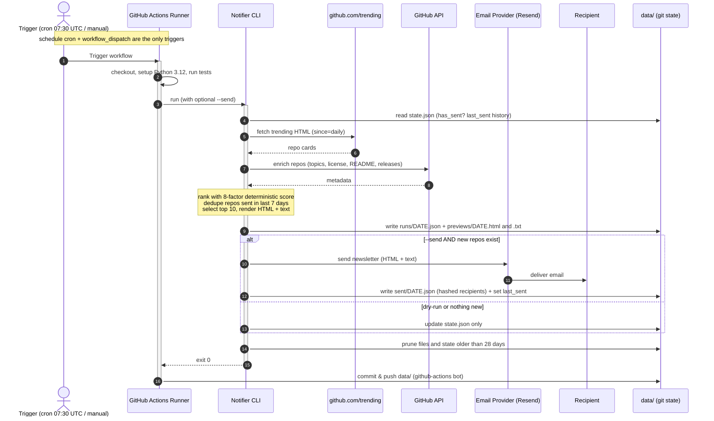

# GitHub Trending Digest

Daily developer intelligence from GitHub Trending.

The project goal is to inspect every repository returned by
`https://github.com/trending?since=daily` for programming language `any` and
spoken language `any`, enrich those repositories with public GitHub metadata,
rank them by practical developer value, and send a concise daily email.

Current status: MVP CLI scaffold is implemented with parser, scoring, rendering,
state, email adapters, tests, and a daily GitHub Actions workflow.

## Direction

- Runtime: Python 3.12 CLI.
- Scheduler: GitHub Actions `schedule` plus manual `workflow_dispatch`.
- Hosting: no always-on server; run once per day.
- State: committed JSON files under `data/`.
- Email: adapter-based sender, starting with SMTP or a free email API provider.
- AI use: optional. MVP scoring should be deterministic and explainable.

## Architecture

The system is **serverless**: there is no always-on host. GitHub Actions runs the
pipeline once per day on an ephemeral runner, the run commits its state back into
the repository (`data/`), and the machine is then discarded. The sequence below
shows a full daily run end to end.



| Layer | Responsibility |
| --- | --- |
| **Trigger** | `schedule` (cron `30 7 * * *` = 10:30 Europe/Istanbul) + manual `workflow_dispatch` |
| **Runner** | Ephemeral `ubuntu-latest`; checkout, tests, run CLI, commit state back to git |
| **CLI pipeline** | fetch -> parse -> enrich -> rank (8-factor) -> dedupe + top 10 -> render -> send -> record -> prune |
| **Email** | Adapter for Resend / Brevo / SMTP, selected by `EMAIL_PROVIDER` |
| **State** | Committed JSON under `data/` (no database): `state.json`, `runs/`, `previews/`, `sent/` |

## Local Usage

Run tests:

```bash
PYTHONDONTWRITEBYTECODE=1 PYTHONPATH=src python -m unittest discover -s tests
```

Dry-run from a fixture, without network or credentials:

```bash
PYTHONDONTWRITEBYTECODE=1 PYTHONPATH=src python -m gh_trending_notifier.cli run \
  --date 2026-06-07 \
  --html-file tests/fixtures/trending_daily.html \
  --skip-enrichment
```

Live dry-run from GitHub Trending:

```bash
PYTHONDONTWRITEBYTECODE=1 PYTHONPATH=src GH_TOKEN=... python -m gh_trending_notifier.cli run
```

Use a specific local date basis:

```bash
PYTHONDONTWRITEBYTECODE=1 PYTHONPATH=src APP_TIMEZONE=Europe/Istanbul python -m gh_trending_notifier.cli run
```

Check deployment readiness:

```bash
PYTHONDONTWRITEBYTECODE=1 PYTHONPATH=src python -m gh_trending_notifier.cli doctor
```

Send email after rendering:

```bash
PYTHONDONTWRITEBYTECODE=1 PYTHONPATH=src EMAIL_PROVIDER=smtp MAIL_TO=dev@example.com python -m gh_trending_notifier.cli run --send
```

Supported `EMAIL_PROVIDER` values: `smtp`, `resend`, `brevo`.

## GitHub Actions Setup

The workflow in `.github/workflows/daily.yml` runs tests and generates the
newsletter every day at `06:17 UTC`. It defaults to dry-run. To enable real
email sending, set repository variable `SEND_EMAIL=true` and configure the
provider secrets.

For the no-paid-service deployment model, create a public GitHub repository and
push this project to its default branch. Private repositories can also work, but
they consume the account's included Actions minutes.

Local Git bootstrap:

```bash
git init -b main
git add .
git commit -m "Build GitHub Trending notifier MVP"
git remote add origin git@github.com:<you>/gh-trending-digest.git
git push -u origin main
```

Common settings:

- `APP_TIMEZONE` repository variable: defaults to `Europe/Istanbul` in the
  included workflow.
- `EMAIL_PROVIDER` repository variable: `smtp`, `resend`, or `brevo`.
- `MAIL_FROM` secret.
- `MAIL_TO` secret with comma-separated recipients.

SMTP secrets:

- `SMTP_HOST`
- `SMTP_PORT`
- `SMTP_USERNAME`
- `SMTP_PASSWORD`

API provider secrets:

- `RESEND_API_KEY`
- `BREVO_API_KEY`

Generated archives are written under `data/runs/`, previews under
`data/previews/`, state under `data/state.json`, and send markers under
`data/sent/`.
